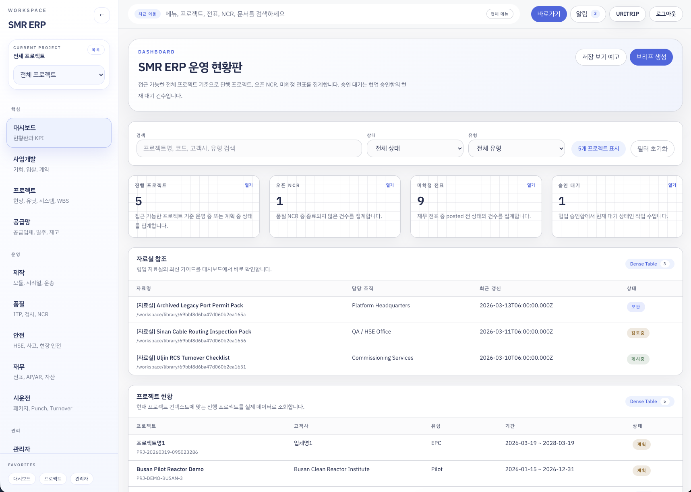
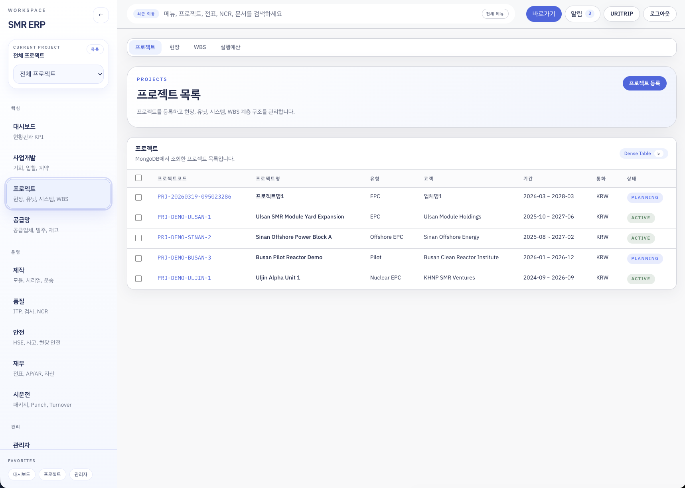
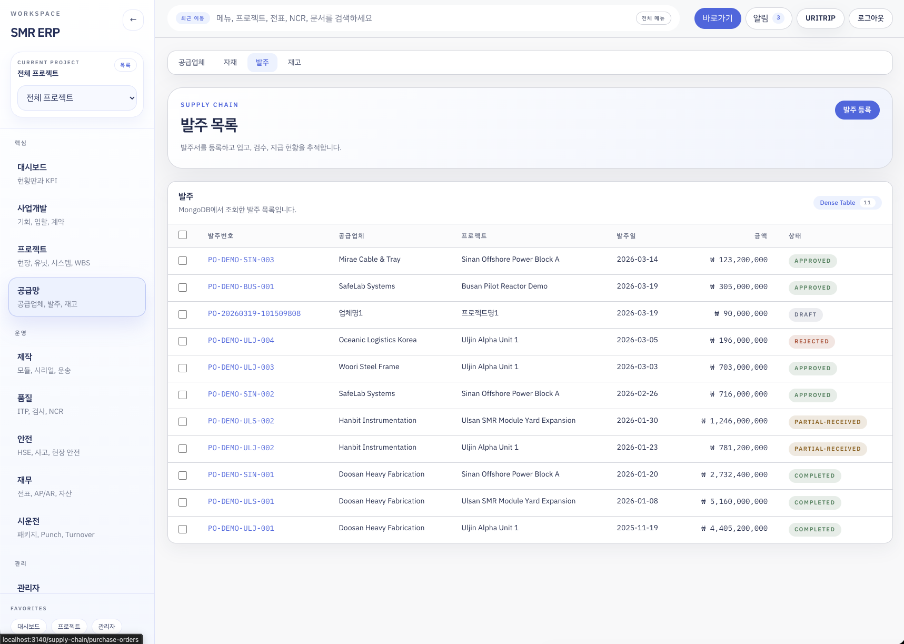
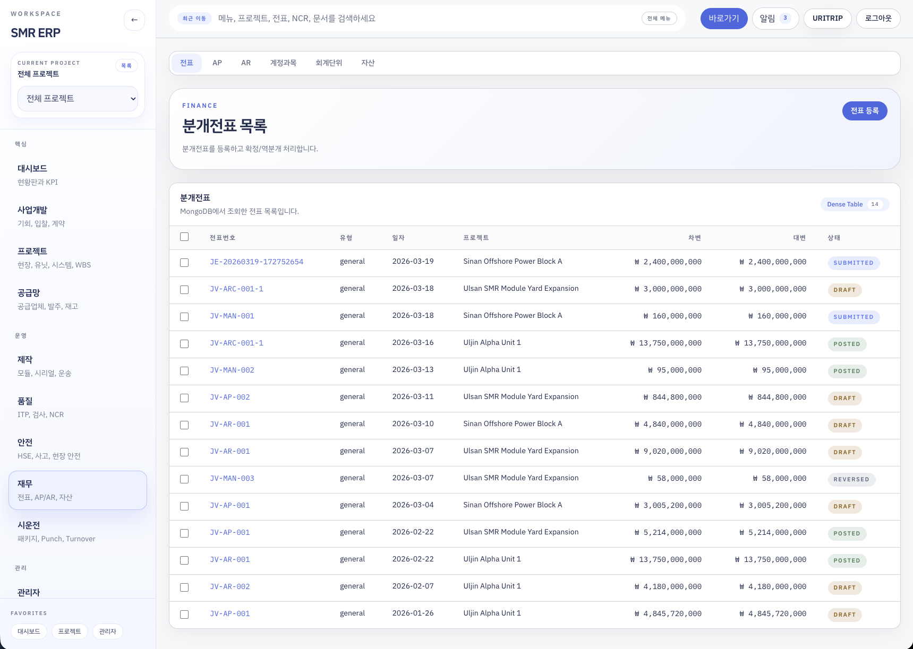

# ERP



프로젝트형 제조, 공급망, 품질, 재무, 시운전 운영을 한 화면에서 처리하기 위한 ERP 웹 애플리케이션입니다.

이 저장소는 단순한 CRUD 샘플이 아니라, 아래 흐름을 하나의 서비스로 연결하는 내부 업무 시스템에 가깝습니다.

- 사업기회 발굴부터 계약 등록
- 프로젝트 생성과 현장, 유닛, 시스템, WBS 구조화
- 실행예산 수립과 집행 추적
- 발주, 입고, 재고 이동, 제조, 출하
- ITP, 검사, NCR, HSE 사고 관리
- AP, AR, 전표, 고정자산, 감가상각
- 시운전 패키지와 규제 대응
- 관리자 권한, 조직, 역할, 협업 자료실, 승인 워크플로우

## 제품 개요

이 시스템이 해결하려는 문제는 프로젝트 조직의 운영 데이터가 부서별로 흩어지는 문제입니다.

- 사업개발팀은 기회와 계약을 관리합니다.
- PMO는 프로젝트, 현장, 유닛, WBS, 예산을 관리합니다.
- 구매/자재팀은 공급업체, 자재, 발주, 입고, 재고를 관리합니다.
- 제작팀은 모듈, 제작오더, 운송을 관리합니다.
- 품질/HSE는 검사, NCR, 사고를 관리합니다.
- 재무팀은 AP, AR, 전표, 자산을 관리합니다.
- 시운전팀은 패키지 진행도와 규제 액션을 관리합니다.
- 플랫폼 관리자는 사용자, 조직, 역할, 정책, 승인함을 운영합니다.

이 앱은 위 데이터를 데이터베이스에 저장하고, 화면과 API를 통해 업무 흐름을 제공합니다.

현재 이 프로젝트는 지속적으로 개선 중이며, 개발자는 잘못된 로직이나 누락된 로직을 운영 흐름에 맞게 계속 보완하고 있습니다.
따라서 일부 화면, 상태 전이, 세부 API 동작은 앞으로도 변경될 수 있습니다.

## 어떤 서비스를 제공하나

### 1. 사업개발

- 고객/거래처(`parties`) 관리
- 사업기회(`opportunities`) 등록, 단계 전진, 수주/실주 처리
- 계약(`contracts`) 생성, 검토 요청, 활성화, 보관
- 계약과 고객, 프로젝트, AR 발행 흐름 연결

### 2. 프로젝트 운영

- 프로젝트(`projects`) 생성
- 프로젝트 하위 구조를 `sites -> units -> systems -> wbs_items` 계층으로 관리
- 프로젝트별 고객 스냅샷, 현장 요약, WBS 연계 예산 저장
- 실행예산(`execution_budgets`) 승인 흐름과 집행 추적

### 3. 공급망 / 자재

- 공급업체 조회는 `parties` 컬렉션에서 `partyRoles: "vendor"` 문서를 사용
- 자재 마스터(`materials`) 관리
- 발주서(`purchase_orders`) 생성, 제출, 승인, 반려, 승인 취소
- 발주 입고 처리 시 `inventory_transactions` 자동 생성
- 현장 간 이동, 출고, 조정 요청/승인/반려 지원

### 4. 제작 / 물류

- 모듈(`modules`) 관리
- 제작오더(`manufacturing_orders`) 생성 및 진행 상태 관리
- 출하(`logistics_shipments`) 관리
- 프로젝트 구조와 연계된 모듈, 제작, 운송 가시화

### 5. 품질 / 안전

- ITP(`itps`) 등록 및 검토/승인 상태 관리
- 검사(`inspections`) 등록 및 검증 처리
- NCR(`ncrs`) 등록 및 종료 처리
- HSE 사고(`hse_incidents`) 등록, 업데이트, 아카이브

### 6. 재무

- 계정과목(`chart_of_accounts`) 계층 관리
- 회계단위(`accounting_units`) 및 월별 회계기간(`periods`) 관리
- AP(`ap_invoices`) 승인/지급/지급 취소
- AR(`ar_invoices`) 발행/발행 취소/수금/수금 취소
- 전표(`journal_entries`) 작성, 제출, 전기, 역분개
- 고정자산(`fixed_assets`) 관리 및 감가상각 스케줄 자동 계산

### 7. 시운전 / 규제

- 시운전 패키지(`commissioning_packages`) 생성과 상태 전이
- 규제 대응 액션(`regulatory_actions`) 일정 추적
- MC 완료, COMM 완료, 인계 상태 관리

### 8. 플랫폼 관리 / 협업

- 사용자(`users`), 조직(`orgUnits`), 역할(`roles`), 정책(`policies`) 관리
- 공지/자료실(`workspacePosts`) 작성
- 검토 요청, 승인함(`approvalTasks`), 승인 이력(`approvalHistory`) 운영
- 알림(`notifications`)과 저장된 뷰(`savedViews`) 제공

## 핵심 사용자 시나리오

### 계약에서 수금까지

1. 사업기회를 생성합니다.
2. 수주 확정 후 계약을 생성/활성화합니다.
3. 계약에 연결된 프로젝트를 생성합니다.
4. AR을 발행합니다.
5. 수금 등록 시 AR 컬렉션 이력과 함께 전표가 자동 생성됩니다.

### 프로젝트 계획에서 집행까지

1. 프로젝트를 생성합니다.
2. 현장, 유닛, 시스템, WBS를 정의합니다.
3. WBS에 연결된 실행예산을 생성합니다.
4. 발주나 AP, 수동 전표가 발생하면 예산 사용액이 재계산됩니다.

### 발주에서 재고 반영까지

1. 공급업체와 자재 마스터를 준비합니다.
2. 발주를 생성하고 승인합니다.
3. 입고를 등록합니다.
4. 입고 시 트랜잭션으로 발주 상태와 재고 트랜잭션이 함께 갱신됩니다.

### 제작에서 시운전 인계까지

1. 모듈을 생성합니다.
2. 제작오더를 발행하고 진행 상태를 변경합니다.
3. 출하를 등록합니다.
4. 시운전 패키지를 생성하고 MC 완료, 시운전 완료, 인계 처리합니다.

### 협업 문서 승인까지

1. 공지 또는 자료실 문서를 초안으로 작성합니다.
2. 검토 요청을 올립니다.
3. 승인함에서 승인 또는 반려합니다.
4. 승인되면 게시중 상태로 전환되고 이력과 접근 기록이 누적됩니다.

## 대표 화면

| 영역 | 주요 페이지 | 설명 |
| --- | --- | --- |
| 대시보드 | `/dashboard` | 진행 프로젝트 수, 미종결 NCR, 미전기 전표, 승인 대기 건수, 자료실 최신 문서를 보여줍니다. |
| 사업개발 | `/business-development`, `/business-development/opportunities`, `/business-development/contracts`, `/business-development/parties` | 기회, 계약, 고객/거래처 운영 화면입니다. |
| 프로젝트 | `/projects`, `/projects/new`, `/projects/sites`, `/projects/wbs`, `/projects/execution-budgets`, `/projects/[projectId]` | 프로젝트 마스터와 현장 구조, WBS, 실행예산, 상세 편집 화면입니다. |
| 공급망 | `/supply-chain/vendors`, `/supply-chain/materials`, `/supply-chain/purchase-orders`, `/supply-chain/inventory` | 공급업체, 자재, 발주, 재고를 관리합니다. |
| 제작 | `/manufacturing/modules`, `/manufacturing/orders`, `/manufacturing/shipments` | 모듈, 제작오더, 운송을 관리합니다. |
| 품질 | `/quality/itps`, `/quality/inspections`, `/quality/ncr` | 품질 계획, 검사, NCR 관리 화면입니다. |
| 안전 | `/safety/hse` | HSE 사고와 안전 이슈 화면입니다. |
| 재무 | `/finance/accounts`, `/finance/accounting-units`, `/finance/ap`, `/finance/ar`, `/finance/journal-entries`, `/finance/assets` | 회계단위, 계정과목, AP, AR, 전표, 자산을 관리합니다. |
| 시운전 | `/commissioning/packages`, `/commissioning/regulatory` | 시운전 패키지와 규제 대응 액션을 추적합니다. |
| 관리자 | `/admin` | 사용자, 조직, 역할, 정책, 프로젝트 배정을 관리합니다. |
| 협업 | `/workspace` | 공지, 자료실, 승인함, 승인 이력을 다룹니다. |
| 인증 | `/login` | Google OAuth 기반 로그인과 개발용 preview login 진입점입니다. |

### 스크린샷

#### 프로젝트

프로젝트 목록과 프로젝트 구조 관리의 진입 화면입니다. 현장, 유닛, 시스템, WBS, 실행예산 관리로 이어집니다.



#### 공급망

발주 목록과 승인, 부분입고, 완료 상태를 추적하는 화면입니다. 자재, 재고, 입고 흐름과 연결됩니다.



#### 재무

분개전표 목록과 상태 흐름을 확인하는 화면입니다. AP, AR, 계정과목, 회계단위, 자산 모듈과 함께 사용합니다.



## 기술 스택

| 구분 | 사용 기술 |
| --- | --- |
| 프레임워크 | Next.js 16.1.6 App Router |
| UI | React 19.2.3 |
| 스타일 | Tailwind CSS v4 |
| 언어 | TypeScript 5 |
| 데이터베이스 | MongoDB Node Driver 7.1.0 |
| 인증 | Google OAuth 2.0 + PKCE + signed session cookie |
| 린트 | ESLint 9 + `eslint-config-next` |

## 아키텍처

### 런타임 구조

- 프런트엔드와 백엔드를 분리한 구조가 아니라, Next.js 한 애플리케이션 안에서 UI와 API를 함께 제공합니다.
- 사용자 화면은 [`src/app/(app)`](./src/app/%28app%29) 아래에 있습니다.
- 로그인 등 공개 페이지는 [`src/app/(public)`](./src/app/%28public%29) 아래에 있습니다.
- 서버 API는 [`src/app/api`](./src/app/api) 아래 Route Handler로 구현되어 있습니다.
- 데이터 액세스는 ORM 없이 [`src/lib/mongodb.ts`](./src/lib/mongodb.ts)의 native MongoDB driver를 직접 사용합니다.

### 권한 체크 구조

- 페이지 네비게이션과 API 모두 권한 코드 기반으로 접근을 제한합니다.
- 공통 권한은 `dashboard.read`, `finance.write` 같은 도메인 단위 코드입니다.
- 세부 액션 권한은 `purchase-order.approve`, `ar.collect`, `asset.depreciation-run` 같은 업무 액션 코드입니다.
- API에서는 [`src/lib/api-access.ts`](./src/lib/api-access.ts)의 `requireApiPermission`, `requireApiActionPermission`을 사용합니다.

### 프로젝트 스코프

- 프로젝트성 데이터는 `projectId` 쿼리 파라미터로 필터링할 수 있습니다.
- `platform_admin`, `executive`는 전체 프로젝트를 조회할 수 있습니다.
- `domain_lead`는 `users.projectAssignments`와 `users.defaultProjectId` 기준으로 접근 가능한 프로젝트만 조회합니다.
- 공통 필터 로직은 [`src/lib/project-scope.ts`](./src/lib/project-scope.ts)에 있습니다.

### MongoDB 트랜잭션

이 프로젝트는 일부 핵심 로직에서 `withTransaction()`을 사용합니다.

- 발주 입고 처리
- 재고 조정/이동 일부 처리
- AP/AR 승인/수금/전표 생성 일부 처리

따라서 개발/운영 MongoDB는 replica set 또는 Atlas처럼 트랜잭션을 지원하는 구성이어야 합니다.

## 인증과 권한

### 로그인 방식

- 기본 로그인은 Google OAuth 2.0입니다.
- `/auth/google`에서 authorization request를 만들고,
- `/auth/google/callback`에서 code exchange와 ID token 검증을 수행합니다.
- state, nonce, code verifier는 `erp_google_state` 쿠키에 서명된 형태로 저장합니다.
- 최종 세션은 `erp_session` 쿠키에 Brotli 압축 + HMAC 서명된 payload로 저장됩니다.

### 앱 레벨 역할

앱의 상위 역할은 아래 3개입니다.

- `platform_admin`
- `domain_lead`
- `executive`

이 역할은 네비게이션 노출과 초기 권한 번들에 사용됩니다. 실제 업무 권한은 `users`, `roles`, `policies` 컬렉션과 Google 로그인 계정 매핑을 통해 확장됩니다.

### 개발용 preview login

`ERP_ENABLE_PREVIEW_LOGIN=true` 이고 `NODE_ENV !== "production"`이면 `/login` 화면에 preview login 카드가 노출됩니다. 이 모드는 개발 편의용이며 운영용 인증이 아닙니다.

## API 구조

이 API는 외부 공개용 REST API가 아니라, 이 웹 애플리케이션이 직접 호출하는 내부 업무 API입니다. 경로 안정성보다 화면과 도메인 로직 일관성을 우선합니다.

### 공통 응답 형식

조회 응답은 대체로 아래 형태를 따릅니다.

```json
{
  "ok": true,
  "source": "database",
  "data": {},
  "meta": {
    "total": 10
  }
}
```

배치/상태 변경 응답은 대체로 아래 형태를 따릅니다.

```json
{
  "ok": true,
  "action": "approve",
  "affectedCount": 3,
  "targetIds": ["...", "...", "..."]
}
```

Bulk endpoint 요청은 보통 아래 payload를 사용합니다.

```json
{
  "action": "approve",
  "targetIds": ["id-1", "id-2"],
  "reason": "optional"
}
```

### API 도메인 맵

| 도메인 | 대표 엔드포인트 | 설명 |
| --- | --- | --- |
| 인증/세션 | `/auth/google`, `/auth/google/callback`, `/auth/login`, `/auth/logout`, `/api/me` | Google 로그인, preview login, 세션 조회를 제공합니다. |
| 대시보드 | `/api/dashboard` | 진행 프로젝트 수, 미종결 NCR 수, 미전기 전표 수, 승인 대기 수, 최신 자료실을 합산합니다. |
| 관리자 | `/api/admin/catalog`, `/api/admin/users`, `/api/admin/org-units`, `/api/admin/roles`, `/api/admin/policies` | 사용자, 조직, 역할, 정책 카탈로그와 CRUD를 제공합니다. |
| 협업 | `/api/platform/workspace`, `/api/platform/workspace/posts`, `/api/platform/workspace/posts/[postId]`, `/actions`, `/events` | 공지/자료실 목록, 상세, 액션, 접근 이력 기록을 제공합니다. |
| 사업개발 | `/api/parties`, `/api/opportunities`, `/api/contracts`, 각 `/bulk`, 각 `[id]` | 고객/거래처, 사업기회, 계약의 CRUD와 상태 전이를 제공합니다. |
| 프로젝트 | `/api/projects`, `/api/projects/[id]`, `/api/projects/[id]/sites`, `/units`, `/systems`, `/wbs`, `/api/execution-budgets` | 프로젝트와 구조 계층, 실행예산을 관리합니다. |
| 공급망 | `/api/vendors`, `/api/materials`, `/api/purchase-orders`, `/api/purchase-orders/[id]/receipt`, `/api/inventory`, `/api/inventory/options`, `/api/supply-chain` | 공급업체, 자재, 발주, 입고, 재고 트랜잭션을 다룹니다. |
| 제작 | `/api/modules`, `/api/manufacturing-orders`, `/api/shipments`, `/api/manufacturing`, `/api/manufacturing/bulk` | 모듈, 제작오더, 출하 데이터와 상태 전이를 제공합니다. |
| 품질/안전 | `/api/itps`, `/api/inspections`, `/api/ncrs`, `/api/hse`, `/api/quality`, `/api/quality/bulk` | ITP 승인, 검사 검증, NCR 종료, HSE 사고 처리를 제공합니다. |
| 재무 | `/api/accounts`, `/api/accounting-units`, `/api/ap`, `/api/ap/[id]/payments`, `/api/ar`, `/api/ar/[id]/collections`, `/api/journal-entries`, `/api/assets`, `/api/assets/depreciation`, `/api/finance`, `/api/finance/bulk` | 계정과목, 회계단위, AP/AR, 전표, 자산, 감가상각을 제공합니다. |
| 시운전 | `/api/commissioning`, `/api/commissioning-packages`, `/api/regulatory`, `/api/commissioning/bulk` | 시운전 패키지와 규제 액션을 관리합니다. |

### 주요 특수 엔드포인트

- `POST /api/purchase-orders/[id]/receipt`
  발주 라인별 입고 수량을 검증하고, `purchase_orders`와 `inventory_transactions`를 트랜잭션으로 함께 갱신합니다.
- `POST /api/ar/[id]/collections`
  AR 수금 내역을 추가하고, 자동 분개 전표를 생성합니다.
- `POST /api/assets/depreciation`
  프로젝트 범위 내 고정자산의 감가상각 스케줄과 장부가를 재계산합니다.
- `POST /api/platform/workspace/posts/[postId]/actions`
  공지/자료실 문서의 검토 요청, 게시 승인, 반려, 보관, 복원을 처리합니다.

### 주요 Bulk Action 예시

| 엔드포인트 | 액션 예시 |
| --- | --- |
| `/api/opportunities/bulk` | `advance-stage`, `close-won`, `close-lost` |
| `/api/contracts/bulk` | `request-review`, `activate`, `archive` |
| `/api/projects/bulk` | `activate`, `hold`, `archive`, `restore` |
| `/api/execution-budgets/bulk` | `submit`, `approve`, `request-revision`, `revoke-approval` |
| `/api/purchase-orders/bulk` | `submit`, `approve`, `reject`, `cancel-approval` |
| `/api/inventory/bulk` | 조정 요청 승인/반려, 재고 이동/조정 처리 |
| `/api/manufacturing/bulk` | `start-order`, `complete-order`, `start-testing`, `ship` |
| `/api/quality/bulk` | `submit-review`, `approve-itp`, `verify`, `close-ncr` |
| `/api/finance/bulk` | `approve-ap`, `pay`, `issue`, `collect`, `post`, `reverse` |
| `/api/commissioning/bulk` | `start`, `mc-complete`, `comm-complete`, `handover` |

## MongoDB 데이터 구조

### 설계 원칙

이 프로젝트는 관계형 스키마 대신, MongoDB 문서 안에 스냅샷을 함께 저장하는 방식을 적극적으로 사용합니다.

- 참조용 `_id`만 저장하지 않고 `projectSnapshot`, `partySnapshot`, `materialSnapshot`, `budgetSnapshot` 같은 denormalized snapshot을 함께 보관합니다.
- 목록 화면 성능과 변경 이력 보존을 위해 요약 배열(`siteSummaries`, `unitSummaries`)도 유지합니다.
- 거의 모든 생성 문서는 공통 메타데이터를 가집니다.

공통 메타데이터 예시:

```ts
{
  tenantId: "smr-default",
  schemaVersion: 1,
  documentVersion: 1,
  createdAt: "2026-03-21T00:00:00.000Z",
  createdBy: {
    userId: "user@example.com",
    employeeNo: "",
    displayName: "홍길동",
    orgUnitName: "PMO"
  },
  updatedAt: "2026-03-21T00:00:00.000Z",
  updatedBy: {
    userId: "user@example.com",
    employeeNo: "",
    displayName: "홍길동",
    orgUnitName: "PMO"
  }
}
```

### 컬렉션 맵

| 컬렉션 | 역할 | 주요 연결 필드 |
| --- | --- | --- |
| `users` | 로그인 사용자, 기본 프로젝트, 프로젝트 배정 | `orgUnitCode`, `roleCode`, `projectAssignments`, `defaultProjectId` |
| `orgUnits` | 조직 마스터 | `leadUserId`, `leadEmail`, `memberCount` |
| `roles` | 권한 번들 | `permissions[]`, `scope`, `memberCount` |
| `policies` | 운영 정책 문서 | `target`, `ruleSummary` |
| `auditLogs` | 관리자/플랫폼 감사 로그 | `eventCode`, `resource`, `route` |
| `workspacePosts` | 공지/자료실 본문 메타 | `kind`, `status`, `roles`, `linkedMenuHref`, `versionHistory`, `accessHistory` |
| `approvalTasks` | 승인 대기 큐 | `resourceType`, `resourceId`, `resourceKind`, `roles` |
| `approvalHistory` | 승인 이력 | `action`, `result`, `resourceId`, `resourceKind` |
| `notifications` | 개인 알림 | `ownerEmail`, `roles` |
| `savedViews` | 개인 저장 필터 | `ownerEmail`, `href` |
| `parties` | 고객/거래처/공급업체 마스터 | `partyRoles[]`, `taxId` |
| `opportunities` | 사업기회 | `customerSnapshot`, `stage`, `status` |
| `contracts` | 계약 | `customerSnapshot`, `projectSnapshot`, `contractAmount` |
| `projects` | 프로젝트 마스터 | `customerSnapshot`, `siteSummaries`, `status` |
| `sites` | 프로젝트 현장 | `projectSnapshot`, `siteManagerSnapshot`, `unitSummaries` |
| `units` | 현장 하위 유닛 | `projectSnapshot`, `siteSnapshot`, `systemSummaries` |
| `systems` | 유닛 하위 시스템 | `projectSnapshot`, `unitSnapshot`, `discipline` |
| `wbs_items` | WBS 항목 | `projectSnapshot`, `unitSnapshot`, `systemSnapshot`, `costCategory` |
| `execution_budgets` | 실행예산 | `projectSnapshot`, `wbsSnapshot`, `usageSummary` |
| `progress_records` | 프로젝트 진행률/실적성 기록 | 프로젝트/WBS 구조와 연계 |
| `materials` | 자재 마스터 | `materialCode`, `uom`, `status` |
| `purchase_orders` | 발주서 | `vendorSnapshot`, `projectSnapshot`, `budgetSnapshot`, `lines[]` |
| `inventory_transactions` | 입고/출고/이동/조정 이력 | `projectSnapshot`, `siteSnapshot`, `materialSnapshot`, `referenceSnapshot` |
| `modules` | 모듈 | `projectSnapshot`, `systemSnapshot`, `serialNo` |
| `manufacturing_orders` | 제작오더 | `moduleSnapshot`, `status` |
| `logistics_shipments` | 출하/운송 | `projectSnapshot`, `moduleSnapshot`, `status` |
| `itps` | Inspection Test Plan | `projectSnapshot`, `systemSnapshot`, `approvalStatus` |
| `inspections` | 검사 실적 | `projectSnapshot`, `itpSnapshot`, `status` |
| `ncrs` | NCR | `projectSnapshot`, `inspectionSnapshot`, `status` |
| `hse_incidents` | HSE 사고 | `projectSnapshot`, `siteSnapshot`, `occurredAt`, `status` |
| `chart_of_accounts` | 계정과목 트리 | `accountCode`, `parentId`, `accountType` |
| `accounting_units` | 회계단위 | `currency`, `country`, `periods[]`, `fiscalYearStartMonth` |
| `ap_invoices` | 매입채무 | `vendorSnapshot`, `purchaseOrderSnapshot`, `budgetSnapshot`, `paymentHistory` |
| `ar_invoices` | 매출채권 | `customerSnapshot`, `contractSnapshot`, `collectionHistory`, `collectionSummary` |
| `journal_entries` | 전표 | `voucherNo`, `lines[]`, `originType`, `budgetSnapshot` |
| `fixed_assets` | 고정자산 | `projectSnapshot`, `depreciationSchedule`, `ledgerSummary` |
| `commissioning_packages` | 시운전 패키지 | `projectSnapshot`, `systemSnapshot`, `status` |
| `regulatory_actions` | 규제 대응 액션 | `projectSnapshot`, `dueDate`, `ownerSnapshot` |

### 문서 스냅샷 패턴 예시

프로젝트나 거래처를 참조할 때는 보통 아래 같은 구조를 함께 저장합니다.

```ts
projectSnapshot: {
  projectId: "67d...",
  code: "PRJ-20260319-...",
  name: "Hanbit Modular Plant",
  projectType: "EPC"
}

partySnapshot: {
  partyId: "67d...",
  code: "PTY-20260319-...",
  name: "Oceanic Energy",
  partyRoles: ["customer"],
  taxId: "123-45-67890"
}

materialSnapshot: {
  materialId: "67d...",
  materialCode: "MAT-20260319-...",
  description: "Duplex Pipe Spool",
  uom: "EA"
}
```

이 패턴 덕분에 참조 원본이 바뀌더라도 당시 업무 문서에 찍힌 이름과 코드를 유지할 수 있습니다.

### 문서 번호 규칙

[`src/lib/document-numbers.ts`](./src/lib/document-numbers.ts) 기준 번호 prefix는 아래와 같습니다.

| 코드 | 의미 |
| --- | --- |
| `CT-` | 계약 |
| `ORG-` | 조직 |
| `PRJ-` | 프로젝트 |
| `SITE-` | 현장 |
| `UNIT-` | 유닛 |
| `SYS-` | 시스템 |
| `EB-` | 실행예산 |
| `PTY-` | 거래처 |
| `VND-` | 공급업체 |
| `MAT-` | 자재 |
| `PO-` | 발주 |
| `AP-` | AP |
| `AR-` | AR |
| `JE-` | 전표 |
| `MOD-` | 모듈 |
| `MO-` | 제작오더 |
| `SHP-` | 출하 |
| `PKG-` | 시운전 패키지 |
| `REG-` | 규제 액션 |
| `RCV-` | 입고 |
| `TRF-` | 재고 이동 |
| `HSE-` | 사고 |
| `ITP-` | ITP |
| `INSP-` | 검사 |
| `NCR-` | NCR |

## 재무/예산 계산 로직

### 실행예산 사용액

[`src/lib/execution-budget-usage.ts`](./src/lib/execution-budget-usage.ts)는 아래 문서를 합산해 `execution_budgets.usageSummary`를 갱신합니다.

- 승인된 발주 금액 -> `committedAmount`
- 승인/지급된 AP 금액 -> `apActualAmount`
- 수동 전기된 전표 금액 -> `journalActualAmount`

즉, 예산은 단순 편성만 하는 것이 아니라, 발주 커밋과 실제 집행을 함께 추적합니다.

### 고정자산 감가상각

고정자산은 아래 방식을 지원합니다.

- 정액법(`straight-line`)
- 정률법(`declining-balance`)
- 생산량비례법(`units-of-production`, 자동 스케줄 미지원)

`POST /api/assets/depreciation` 실행 시 자동 계산 가능한 자산의 `depreciationSchedule` 과 `ledgerSummary`가 재계산됩니다.

## 디렉터리 구조

```text
web/
├─ scripts/
│  ├─ seed-bootstrap-admin.ts
│  └─ seed-demo-environment.ts
├─ src/
│  ├─ app/
│  │  ├─ (app)/        # 로그인 이후 업무 화면
│  │  ├─ (public)/     # 로그인, unauthorized
│  │  ├─ api/          # Route Handler API
│  │  └─ auth/         # 로그인/로그아웃/OAuth 콜백
│  ├─ components/      # 재사용 UI, 레이아웃, 폼, 테이블
│  └─ lib/             # 인증, 권한, Mongo, 도메인 유틸
├─ .env.example
├─ LICENSE
├─ package.json
└─ README.md
```

## 실행 환경

- Node.js 20+ 권장
- MongoDB transaction 지원 환경 권장
- Google OAuth Client 필요

## 환경 변수

| 변수 | 설명 |
| --- | --- |
| `APP_BASE_URL` | 앱 기본 URL |
| `ERP_AUTH_SECRET` | 세션 서명용 비밀값 |
| `GOOGLE_CLIENT_ID` | Google OAuth Client ID |
| `GOOGLE_CLIENT_SECRET` | Google OAuth Client Secret |
| `GOOGLE_REDIRECT_URI` | OAuth redirect URI |
| `GOOGLE_HOSTED_DOMAIN` | 허용할 Google Workspace 도메인 제한 |
| `GOOGLE_DEFAULT_ROLE` | 디렉터리 매핑 전 기본 앱 역할 |
| `GOOGLE_PLATFORM_ADMIN_EMAILS` | env 고정 플랫폼 관리자 이메일 목록 |
| `GOOGLE_DOMAIN_LEAD_EMAILS` | env 고정 업무담당자 이메일 목록 |
| `GOOGLE_EXECUTIVE_EMAILS` | env 고정 경영진 이메일 목록 |
| `ERP_ENABLE_UNPROVISIONED_GOOGLE_LOGIN` | `users`에 등록되지 않은 Google 사용자에게 임시 로그인 허용 여부 |
| `ERP_UNPROVISIONED_GOOGLE_ROLE` | 미등록 Google 사용자에게 부여할 앱 역할. 현재는 `executive`를 권장 |
| `ERP_ENABLE_PREVIEW_LOGIN` | 개발용 preview login 활성화 여부 |
| `MONGODB_URI` | MongoDB 연결 문자열 |
| `MONGODB_DB_NAME` | 사용할 DB 이름 |

예시는 [.env.example](./.env.example)를 참고하면 됩니다.

`ERP_ENABLE_UNPROVISIONED_GOOGLE_LOGIN=true` 로 설정하면 `users` 컬렉션에 등록되지 않은 Google 사용자도 로그인할 수 있습니다.
이 경우 권한은 `ERP_UNPROVISIONED_GOOGLE_ROLE` 값으로 부여되며, `executive`를 사용하면 수정 권한 없이 읽기 중심으로 접근합니다.

## 시작하기

```bash
npm install
npm run dev
```

기본 개발 서버는 `http://localhost:3140` 에서 실행됩니다.

## 시드 데이터

### 1. 첫 관리자 계정 생성

Google 계정으로 처음 로그인할 수 있는 부트스트랩 관리자를 만듭니다.

```bash
npm run db:seed:admin -- --email your-google@example.com --name "Your Name"
```

이 스크립트는 아래 문서를 idempotent 하게 upsert 합니다.

- `roles`
- `orgUnits`
- `users`

생성되는 기본 role code 는 `ROLE-BOOTSTRAP-PLATFORM-ADMIN` 입니다.

### 2. 데모 환경 시드

연결된 전체 데모 데이터를 삽입합니다.

이 데모 시드에 포함된 조직명, 인명, 이메일, 프로젝트명, 문서번호, 사업자번호 형식 값은 모두 AI로 생성한 허구 데이터입니다.
실제 개인, 기업, 기관, 프로젝트와의 관련성을 의도하지 않습니다.

```bash
npm run db:seed:demo
```

옵션:

```bash
npm run db:seed:demo -- --dry-run
npm run db:seed:demo -- --no-reset
```

- `--dry-run`: 어떤 컬렉션에 몇 건이 들어갈지 출력만 합니다.
- `--no-reset`: 동일 `seedTag` 문서를 먼저 삭제하지 않고 추가합니다.

데모 시드는 `users`, `roles`, `orgUnits`, `projects`, `sites`, `units`, `systems`, `wbs_items`, `execution_budgets`, `materials`, `purchase_orders`, `inventory_transactions`, `modules`, `manufacturing_orders`, `logistics_shipments`, `itps`, `inspections`, `ncrs`, `hse_incidents`, `chart_of_accounts`, `accounting_units`, `ap_invoices`, `ar_invoices`, `journal_entries`, `fixed_assets`, `commissioning_packages`, `regulatory_actions`, `workspacePosts`, `approvalTasks`, `approvalHistory` 등 서로 연결된 전체 업무 예시를 생성합니다.

## 라이선스

This project is licensed under the Apache License 2.0. See [LICENSE](./LICENSE) for the full text.

이 프로젝트는 [Apache License 2.0](./LICENSE)을 따릅니다.
법적 효력은 `LICENSE`의 영문 원문을 기준으로 합니다.
